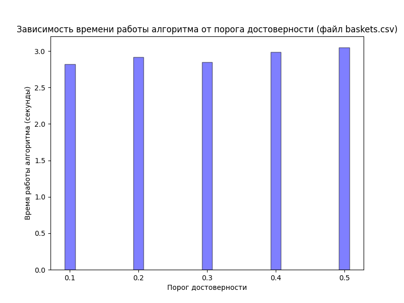
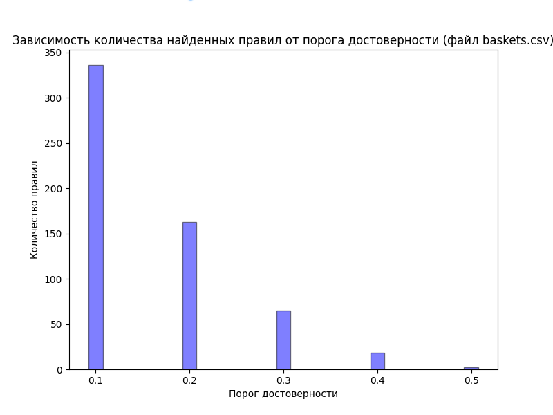

# Отчет по практической работе по теме: "Поиск ассоциативных правил"

## Подготовил: студент группы КЭ-401 Гордеев Александр Сергеевич

### Формулировка задания

- Доработайте программу из задания Поиск частых наборов, чтобы она также выполняла поиск ассоциативных правил. Список результирующих правил должен выдаваться в удобочитаемом виде (антецедент→консеквент) с указанием поддержки и достоверности каждого правила. Дополнительные параметры программы: порог достоверности, способ упорядочивания результирующего списка наборов (по убыванию значения поддержки или лексикографическое).

- Проведите эксперименты на наборах из задания 1. В экспериментах Зафиксируйте значение пороговое значение поддержки (например, 10%), варьируйте пороговое значение достоверности (например, от 70% до 95% с шагом 5%).

- Выполните визуализацию полученных результатов в виде следующих диаграмм:

  - сравнение быстродействия поиска правил на фиксированном наборе данных при изменяемом пороге достоверности;

  - общее количество найденных правил на фиксированном наборе данных при изменяемом пороге достоверности.

  - Подготовьте список правил, в которых антецедент и консеквент суммарно включают в себя не более семи объектов (разумное количество). Проанализируйте и изложите содержательный смысл полученного результата.

- Подготовьте отчет о выполнении задания и загрузите отчет в формате PDF в систему. Отчет должен представлять собой связный и структурированный документ со следующими разделами:  

  - формулировка задания;

  - гиперссылка на каталог репозитория с исходными текстами, наборами данных и др. сопутствующими материалами;

  - рисунки с результатами визуализации;

  - пояснения, раскрывающие смысл полученных результатов.

### Исходный код на Github

[https://github.com/MrSago/Technologies-of-Analytical-Processing-of-Information-for-Susu](https://github.com/MrSago/Technologies-of-Analytical-Processing-of-Information-for-Susu)

### Визуализация результатов

### Сравнение быстродействия на фиксированном наборе данных при изменяемом пороге достоверности

#### Сравнение количества частых наборов на фиксированном наборе данных при изменяемом пороге достверности

