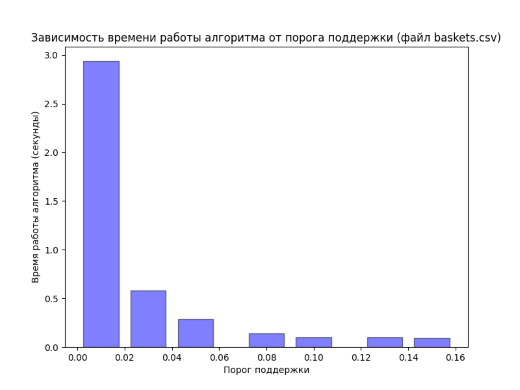

# Отчет по практической работе по теме: "Поиск частых наборов"

## Подготовил: студент группы КЭ-401 Гордеев Александр Сергеевич

### Формулировка задания

1. Разработайте программу, которая выполняет поиск частых наборов объектов в заданном наборе данных с помощью алгоритма Apriori (или одной из его модификаций). Список результирующих наборов должен содержать как наборы, так и значение поддержки для каждого набора. Параметрами программы являются набор, порог поддержки и способ упорядочивания результирующего списка наборов (по убыванию значения поддержки или лексикографическое).
2. Проведите эксперименты на наборе данных baskets.csv (сведения о покупках в супермаркете). В экспериментах варьируйте пороговое значение поддержки (например: 1%, 3%, 5%, 10%, 15%).
3. Выполните визуализацию результатов экспериментов в виде следующих диаграмм: сравнение быстродействия на фиксированном наборе данных при изменяемом пороге поддержки; количество частых наборов объектов различной длины на фиксированном наборе данных при изменяемом пороге поддержки.
4. Подготовьте отчет о выполнении задания и загрузите отчет в формате PDF в систему. Отчет должен представлять собой связный и структурированный документ со следующими разделами:
     - формулировка задания;
     - гиперссылка на каталог репозитория с исходными текстами, наборами данных и др. сопутствующими материалами;
     - рисунки с результатами визуализации;
     - пояснения, раскрывающие смысл полученных результатов.

### Исходный код на Github

[https://github.com/MrSago/Technologies-of-Analytical-Processing-of-Information-for-Susu](https://github.com/MrSago/Technologies-of-Analytical-Processing-of-Information-for-Susu)

### Визуализация результатов

### Сравнение быстродействия на фиксированном наборе данных при изменяемом пороге поддержки

#### Сравнение количества частых наборов на фиксированном наборе данных при изменяемом пороге поддержки

### Результаты экспериментов

Время работы алгоритма Apriori и количество частых наборов при различных порогах поддержки в соотношении примерно равны, что видно из двух диаграмм. Из этого следует, что примитивный алгоритм Apriori эффективен на небольших наборах данных, но он может быть вычислительно дорогостоящим на очень больших данных из-за необходимости многократного прохода по набору данных и проверки большого количества кандидатов на каждом этапе. Чтобы уменьшить время работы алгоритма, можно увеличить порог поддержки. Это свойство анти-монотонности служит для снижения размерности пространства поиска. Инчае говоря, с ростом размера набора элементов поддержка уменьшается, либо остается такой же.
